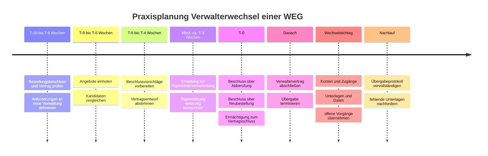
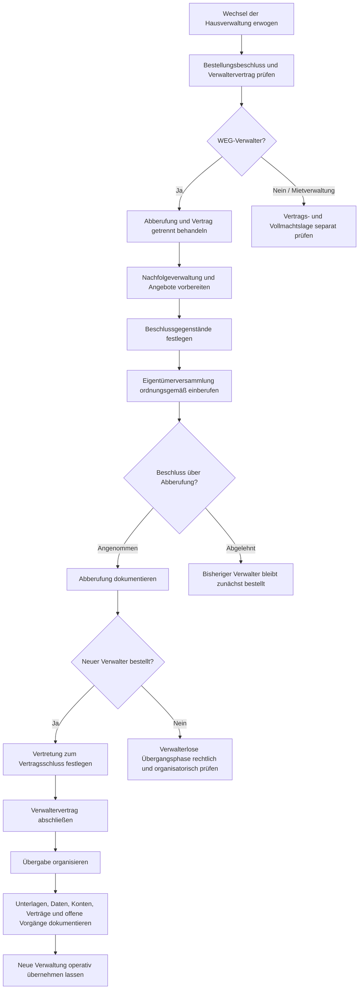

# Prozesse, Vorlagenübersicht und Redaktionsplan

## Vorlagenvergleich

| Vorlage | Zweck | Beschluss erforderlich? | wichtigste Variable | kritischer Punkt |
|---|---|---|---|---|
| Protokoll und Bestellung | Bestellung dokumentieren | Ja | Bestellungszeitraum | klare Beschlussformulierung |
| Verwaltervertrag | Leistungen und Vergütung regeln | entsprechende Vertretung sicherstellen | Leistungsumfang | Bestellung ist nicht der Vertrag |
| Vollmacht | konkrete Vertretungsbefugnis dokumentieren | je nach Inhalt und Sachverhalt | Gegenstand und Grenze | § 9b WEG berücksichtigen |

Die Muster liegen im Verzeichnis `vorlagen/`.

Der Vorteil der Vollmachtsvorlage gegenüber einer pauschalen Vollmacht
"Person X darf Verträge schließen" ist die klare Begrenzung nach
Vertragsgegenstand, Betrag und Dauer. Gerade weil die gesetzliche
Außenvertretung des WEG-Verwalters weit reicht und Beschränkungen gegenüber
Dritten grundsätzlich unwirksam sind, sollten interne Befugnisse und gesonderte
Vollmachten präzise dokumentiert werden.

## Praxis-Timeline für einen Verwalterwechsel

Die Zeitangaben außerhalb der Drei-Wochen-Einberufungsfrist sind
Projektplanungswerte, keine gesetzlichen Fristen.

## Ablauf Kündigungsprozess

## Keyword-Portfolio

Das vollständige Portfolio mit 30 Begriffen liegt als
`keywords/keyword-portfolio.csv` vor.

Einschränkung: Live-Suchvolumina konnten nicht abgerufen werden, da für das
verbundene Semrush-Konto nicht genügend API-Einheiten verfügbar waren. Die
Spalte `volumen_band_de` enthält heuristische Planungsbandbreiten für
Deutschland, keine gemessenen Werte. Vor einer finalen Budget- oder
SEO-Entscheidung sind die Begriffe in einem Live-Keyword-Tool zu validieren.

Priorisierungslogik:

- A: unmittelbar umsatz- oder leadnah, oder lokal besonders relevant
- B: starker Mid-Funnel- und Ratgeberintent
- C: unterstützender Longtail beziehungsweise aktuelles Informationscluster

Bei fristbezogenen Gesetzesthemen (Fernablesung 2026, Heizungsprüfung 2027) ist
das Suchinteresse zeitlich stark schwankend, die Bandbreite ist dort besonders
unsicher. Die zugrunde liegenden Fristen selbst sind amtlich belegt.

## Redaktionsplan für drei Monate

Start nach dem Recherche-Stichtag 10.09.2026. Ziel ist nicht maximale
Veröffentlichungsfrequenz, sondern ein vollständiges WEG-Wechselcluster plus
aktuelle Fachkompetenz 2026/2027, anschließend Ausbau von Mietverwaltung und
SEV.

| Datum | Thema | Format | Primary Keyword | Funnel | interner Hauptlink |
|---|---|---|---|---|---|
| 15.09.2026 | WEG-Verwaltung in Potsdam | Landingpage | weg verwaltung potsdam | Bottom | Kontakt |
| 22.09.2026 | Wie kündige ich die Hausverwaltung einer WEG? | Blog 1.800 bis 2.200 W. | hausverwaltung kündigen weg | Mid | WEG-Landingpage |
| 29.09.2026 | Bestellung einer Hausverwaltung | PDF und Vorlagenseite | bestellung hausverwaltung protokoll | Mid/Lead | Verwalterwechsel |
| 06.10.2026 | Verwalterwechsel WEG Schritt für Schritt | Blog 2.000 bis 2.500 W. | verwalterwechsel weg | Mid/Bottom | WEG-Landingpage |
| 13.10.2026 | Was darf eine Hausverwaltung? | Blog 1.600 bis 2.200 W. | was darf eine hausverwaltung | Top/Mid | WEG |
| 20.10.2026 | Fernablesung bis Ende 2026 | Aktualitätsartikel | heizkostenverordnung fernablesung 2026 | Top | WEG und Mietverwaltung |
| 27.10.2026 | Verwaltervertrag und Vollmacht | 2 PDFs und Hubseite | verwaltervertrag muster weg | Lead | Verwalterwechsel |
| 03.11.2026 | Was macht eine gute Hausverwaltung aus? | Blog | gute hausverwaltung | Commercial | WEG |
| 10.11.2026 | Zertifizierter Verwalter erklärt | Fachbeitrag | zertifizierter verwalter | Commercial | Gute Hausverwaltung |
| 17.11.2026 | GModG 2026 für Eigentümergemeinschaften | Fachbeitrag | gebäudemodernisierungsgesetz weg | Top/Mid | WEG |
| 24.11.2026 | Balkonkraftwerk in der WEG | Blog | balkonkraftwerk weg beschluss | Top | WEG |
| 01.12.2026 | Virtuelle Eigentümerversammlung | Blog | virtuelle eigentümerversammlung | Top/Mid | WEG |
| 03.12.2026 | Mietverwaltung in Potsdam | Landingpage | mietverwaltung potsdam | Bottom | Kontakt |
| 08.12.2026 | SEV gegen WEG-Verwaltung | Blog und Leistungslink | sondereigentumsverwaltung | Mid/Bottom | SEV |
| 10.12.2026 | Sondereigentumsverwaltung Potsdam | Landingpage | sondereigentumsverwaltung potsdam | Bottom | Kontakt |

Zu jedem Artikel sollte ein Social-Derivat entstehen.

Beispiel LinkedIn:

> Ein Verwalterwechsel besteht aus mehr als einer "Kündigung".
>
> Im WEG müssen Eigentümer insbesondere zwischen Abberufung des Verwalters und
> dem Verwaltervertrag unterscheiden. Hinzu kommen Neubestellung, Vertretung
> beim Vertragsabschluss und eine geordnete Übergabe.
>
> Gerade die letzte Phase entscheidet darüber, ob laufende Schäden,
> Dienstleisterverträge, Zahlungen und Unterlagen sauber beim neuen Verwalter
> ankommen.
>
> Wir haben den Ablauf für Eigentümergemeinschaften Schritt für Schritt
> zusammengefasst.
>
> Verwalterwechsel in Potsdam strukturiert vorbereiten, [Link]
